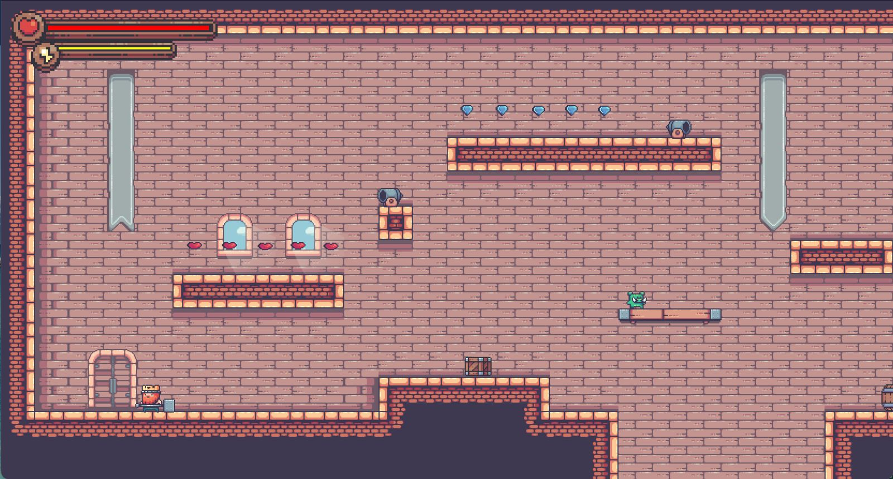
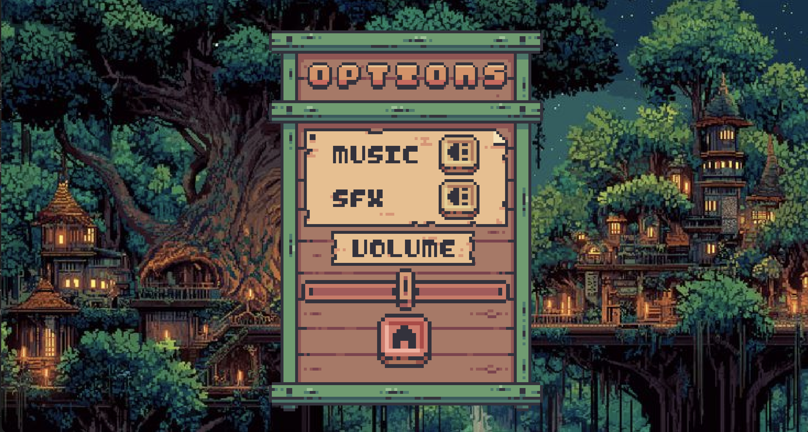
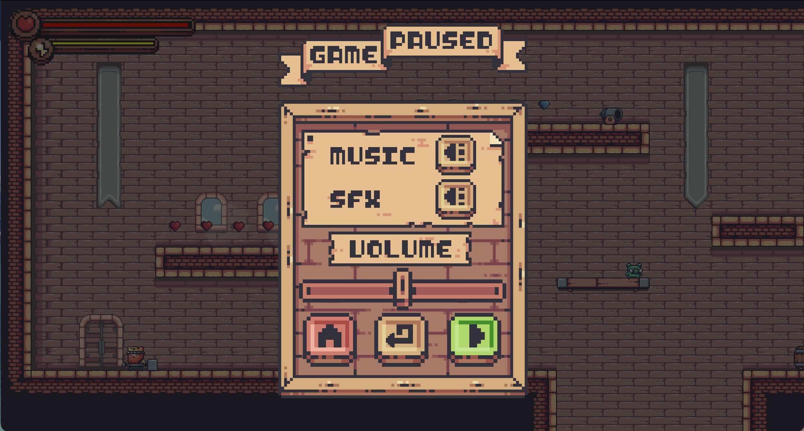

# 🏰 Dungeons and Pigs *(Platformer Game in Java)*

This is a **2D pixel-art platformer game** built from scratch in Java — featuring multiple enemies, levels, UI screens, audio controls, and interactive mechanics.

---

##  Game Overview

- **Genre:** 2D Platformer / Action
- **Engine/Framework:** Custom Game Engine (Java + Swing)
- **Objective:** Navigate levels, overcome obstacles, and defeat enemies.

Features include:

- Cannons and projectiles
- Level progression
- Settings /Menu and audio controls

---

## User Interface (UI) & Game Systems

### Settings Panel
- Music toggle
- Sound effects toggle
- Master volume slider

### Pause Menu
- Resume game
- Return to main menu
- Adjust settings

### Game State Manager
Manages transitions between menu, gameplay, and options.
here is a screenshot of volume control options page...

here is the pause menu screenshot...

---

## 🧠 What I Learned

### ☕ Java Fundamentals

I implemented:

- **Classes** — reusable for UI, entities, levels
- **Interfaces** — clean contracts for logic components 
- **Enums** — handling game states 
- **Tiled** — using Tiled Map Editor for level design

### 🧩 Object-Oriented Programming

Applied:

- Inheritance
- Encapsulation
- Polymorphism

Example: `Player`, `Enemy` and `Pig` all inherit from `Entity`.

---

